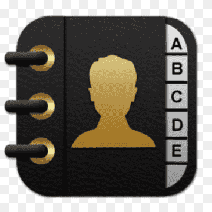
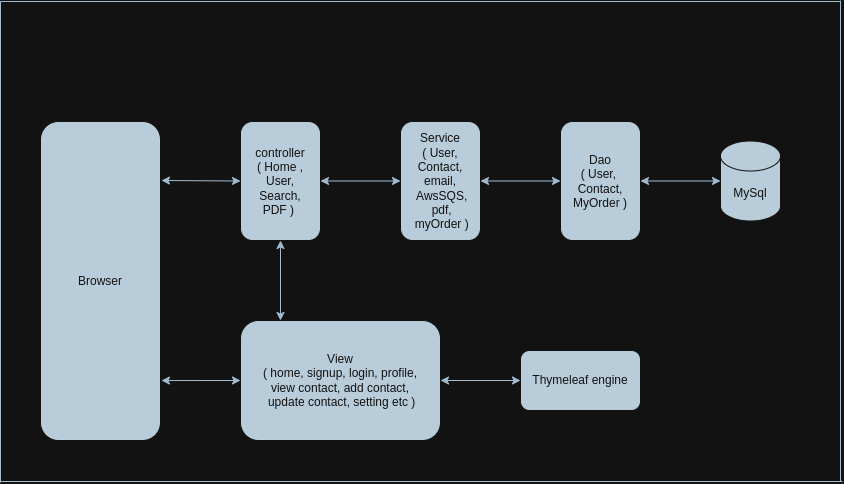

# Contact Manager   

It is a contact management system were user can manage there contacts and view it. It is a fullstack web project
containing both frontend and backend.

## What is the use of this Repo

1. User **Form** base login.
2. **CRUD** operation on **User** and **Contact**.
3. **Search** and **pagination** on view contact page.
4. Implement AWS **Queue**, **Lambda** and **SES**.
5. Dynamic web page using **Thymeleaf**.
6. Send welcoming **Email** to user.
7. **Razorpay** Payment integration.
8. **Tiny MCE** HTML editor.
9. **Pdf** generation on sample html.
10. **MySql** Database.
11. Adding **Image**

## TechStack used

- SpringBoot (Spring Security, JavaX, OpenPdf, JPA)
- Thymeleaf
- AWS (Queue, Lambda, SES and CloudWatch)
- Html, CSS and JavaScript
- Python (Lambda Script)

## Integration

- Razorpay Payment Gateway
- Tiny MCE editor
- Bootstrap
- SweetAlert

## Application design

#### MVC Design



#### Schema Design

## Features

- User registration and login.
- Send welcome email to user.
- Accept Donation from the user.
- User can change password and profile picture.
- View, Add, Update and Delete contacts.
- Generate PDF.

## URL

```text
Base URL:   http://localhost:8080
```

##### Home

| Action            | Controller | Method | Url ("/")    | view         |
|-------------------|------------|--------|--------------|--------------|
| Home page         | home       | GET    | /            | /home.html   |
| About page        | home       | GET    | /about       | /about.html  |
| Registration Page | home       | GET    | /signup      | /signup.html |
| Login  page       | home       | GET    | /signin      | /login.html  |
| Register User     | home       | POST   | /do_register | /signup.html |

##### Forgot Password

| Action          | Controller | Method | Url ("/")        | success view               | failure view     | failure reason |
|-----------------|------------|--------|------------------|----------------------------|------------------|----------------|
| Forgot Password | home       | GET    | /forgot          | /email_form.html           | -                |                |
| Send OTP        | home       | POST   | /send-otp        | /verify-otp.html           | /email_form.html | wrong email    |
| Verify OTP      | home       | POST   | /verify-otp      | /password_change_form.html | /verify-otp.html | wrong otp      |
| New Password    | home       | DELETE | /change-password | /login.html                |                  |                |


`All the above URL are public url, below one is private.`


##### User Api

| Action          | Controller | Method | Url ("/user")    | view ("/normal")     | 
|-----------------|------------|--------|------------------|----------------------|
| User Dashboard  | User       | GET    | /index           | /user_dashboard.html | 
| User profile    | User       | GET    | /profile         | /profile.html        | 
| User setting    | User       | GET    | /setting         | /setting.html        | 
| Change Password | User       | GET    | /change-password | /user_dashboard.html | 

##### Contact Api

| Action                   | Controller | Method | Url ("/user")                | view ("/normal")       | 
|--------------------------|------------|--------|------------------------------|------------------------|
| Add Contact Page         | User       | GET    | /add-contact                 | /add_contact_form.html | 
| Add Contact Detail       | User       | POST   | /process-contact             | /add_contact_form.html | 
| Search Contact           | Search     | GET    | /search/{query}              | -                      | 
| Show List Of Contact     | User       | GET    | /show-contacts/{page_no}     | /show_contacts.html    | 
| Show Single Contact Info | User       | GET    | /contact/{contact_id}        | /contact_detail.html   | 
| Show Update Contact Page | User       | POST   | /update-contact/{contact_id} | /update_contact.html   | 
| Update Contact           | User       | POST   | /process-update              | /contact_detail.html   | 
| Delete Contact           | User       | GET    | /delete/{cId}                | /show_contacts.html    | 

##### Payment Api

| Action                      | Controller | Method | Url ("/user")         |
|-----------------------------|------------|--------|-----------------------|
| Initiate Donation           | User       | POST   | /create-payment-order |
| Update Payment Status in DB | User       | POST   | /create-payment-order |

##### PDF Api

| Action       | Controller | Method | Url ("/user") |
|--------------|------------|--------|---------------|
| Download PDF | PDF        | GET    | /createPdf    |

## Resources

- [SpringBoot Project Structure](https://start.spring.io/)
- [Maven Repository](https://mvnrepository.com/artifact/org.springframework)
- [JDK-11](https://www.oracle.com/in/java/technologies/javase/jdk11-archive-downloads.html)

## Running the application locally

There are several ways to run a Spring Boot application on your local machine.

- One way is to execute the `main` method in the `src.main.java.com.contactManager.ContactManagerApplication`
  class from your IDE.


- Or you can use the command given below while in the target project:

```shell
mvn spring-boot:run
```

## 🚀 About Me
I'm a full stack developer...
### Hi, I'm Suraj Verma! 👋
`vermasuraj@gmail.com`

[](https://surajverma008.netlify.app/) <br>
[](https://www.linkedin.com/in/surajverma008/)